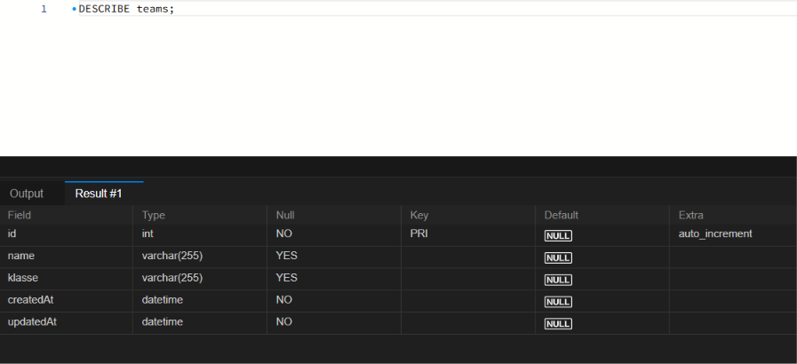
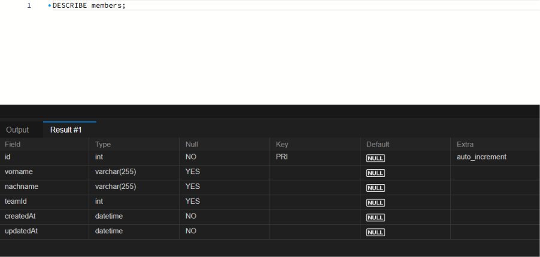
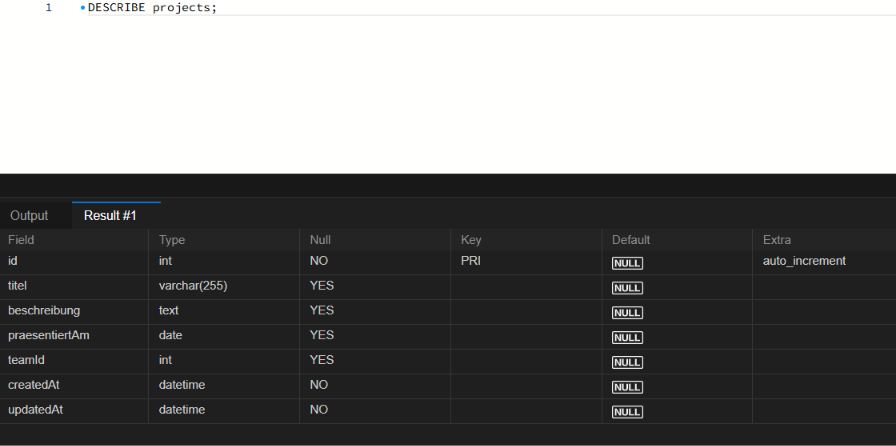

## Einheit 2 - Datenbank-Grundlagen und Sequelize-CLI

### Ausgefüllte Planungsvorlage (ER-Modell)

[Planungsvorlage](Planungsvorlage.html)

### Liste der verwendeten CLI-Befehle

#### 1. In den Backend Ordner wechseln
`cd backend`

#### 2. Node Projekt initialisieren
`npm init -y`

#### 3. Laufzeit-Dependencies installieren
`npm install express cors morgan sequelize cookie-parser mysql2`

#### 4. Sequelize CLI als Entwicklungs-Dependency installieren
`npm install --save-dev sequelize-cli`

#### 5. Sequelize Ordnerstruktur initialisieren
`npx sequelize-cli init`

#### 6. Models generieren
`npx sequelize-cli model:generate --name Team --attributes name:string,klasse:string`

`npx sequelize-cli model:generate --name Member --attributes vorname:string,nachname:string,teamId:integer`

`npx sequelize-cli model:generate --name Project --attributes titel:string,beschreibung:text,praesentiertAm:dateonly,teamId:integer`

#### 7. Migrationen / Tabellen in der Datenbank anlegen
`npx sequelize-cli db:migrate`

### Screenshot der angelegten Tabellen in eurem DB-Tool

Table: teams

Table: members

Table: projects

